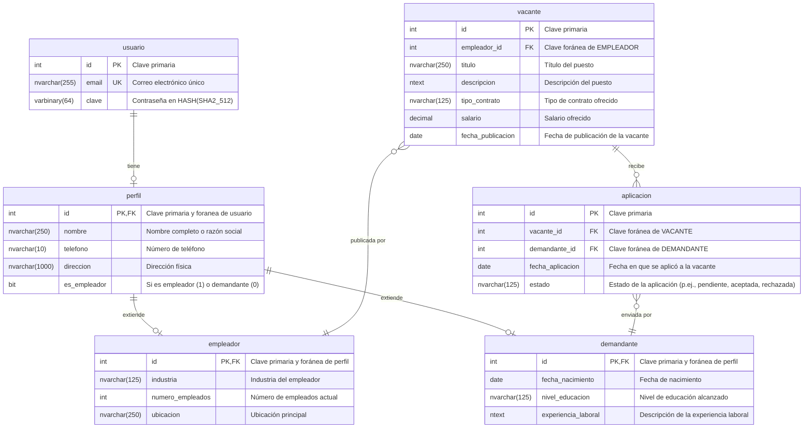
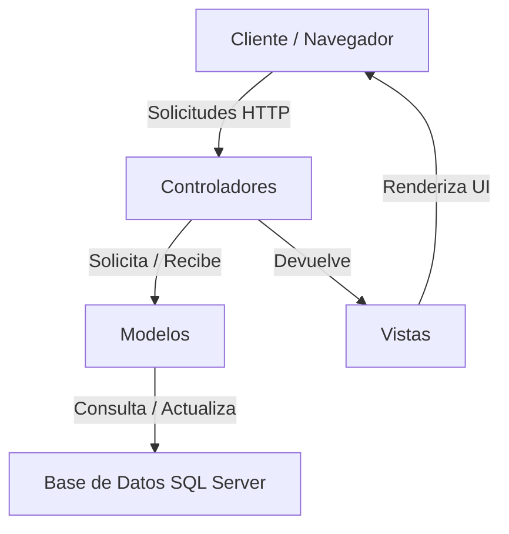

# Aplicación de Emparejamiento de Recursos Humanos

## Diseño de la base de datos



## Diagrama General de Arquitectura (MVC)



## Requisitos técnicos

- .NET 8
- Docker Desktop

## Configuración de la base de datos

### Despliegue de SQL Server (Terminal)

```bash
docker run -e "ACCEPT_EULA=Y" -e 'TZ=America/Bogota' -e "MSSQL_COLLATION=Modern_Spanish_100_CI_AI_SC_UTF8" -e "MSSQL_SA_PASSWORD=Q/vX9S9zNWRVK\Zt" -p 1433:1433 --name mssqlsrv --hostname mssqlsrv -d mcr.microsoft.com/mssql/server:latest
```

### Creación de la base de datos (Cliente SQL)

```SQL
CREATE DATABASE hr_db
```

### Inicio de sesión (Cliente SQL)

```SQL
CREATE LOGIN hr_login WITH PASSWORD = 'zCkpkLYuhz95DSkc', DEFAULT_DATABASE = hr_db
```

### Usuario de la base de datos (Cliente SQL)

```SQL
USE hr_db
CREATE USER hr_user FOR LOGIN hr_login
```

### Creación del esquema (Cliente SQL)

```SQL
CREATE SCHEMA hr_schema AUTHORIZATION hr_user
ALTER USER hr_user WITH DEFAULT_SCHEMA = hr_schema
```

### Despliegue de la migración sobre la base de datos (Terminal)

```bash
dotnet ef database update
```

